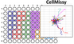

# CellMissy
 

 * [Project Description](#project-description)
 * [Downloads](#downloads)
 * [News](#news)
 * [Usage](#usage)
 * [Project Support](#project-support)

----

## Project Description

*CellMissy* is a cross-platform data management system for cell migration/invasion data that simplifies and fully automates data management, storage and analysis, from experimental set-up to data visualization and exploration. 
*CellMissy* is a client-server application with a graphical user interface on the client, and a relational database in the back-end to store the data. The client application is composed of three modules that cover the different functions of *CellMissy*: the Experiment Manager, the Data Loader and the Data Analyzer. On top of these modules, *CellMissy* provides tools for import/export of full experiments and templates.

### Citation
*CellMissy* is described in “*CellMissy: a tool for management, storage and analysis of cell migration data produced in wound healing-like assays.*” (P. Masuzzo, N. Hulstaert, L. Huyck, C. Ampe, M. Van Troys and L. Martens, PMID: [23918247](http://www.ncbi.nlm.nih.gov/pubmed/23918247))

The single-cell analysis is presented in “*An end-to-end software solution for the analysis of high-throughput single-cell migration data.*” (P. Masuzzo, L. Huyck, A. Simiczyjew, C. Ampe, L. Martens, and M. Van Troys, PMID: [28205527](http://www.ncbi.nlm.nih.gov/pubmed/28205527))

[Go to top of page](#cellmissy)

----

## News
**January 2018**:
[CellMissy 1.2.0](https://github.com/compomics/cellmissy/releases/tag/v1.2.0) adds the DoRes module, which enables dose-response analyses for collective migration experiments as well as generic dose-response dataset!

**June 2016**:
[CellMissy 1.1.0](releases/CellMissy-1.1.0.zip) is now available! Single-cell migration analysis implemented!
Look at how to import single-cell migration data into CellMissy [here](https://figshare.com/articles/Single-cell_data_import_-_how_to/4245059).

**November 30, 2013**: 
[CellMissy 1.0.4](releases/CellMissy-1.0.4.zip) is now available!

**CellMissy**: DB schema has been modified to take into account users privileges in relation to projects and experiments. Download the new SQL script to create your *CellMissy* DB (see more in the [downloads section](#downloads)).

## Downloads
Download *CellMissy* 1.2.0 [here]().

Download *CellMissy* 1.1.0 and 1.0.4 [here](releases/).

### Supportive Files

  * [Example 2D ORIS: data + output](supportFiles/example_ORIS.7z)
  * [Example dataset Scratch](supportFiles/example_dataset_scratch.zip)
  * [CellMissy SQL schema](supportFiles/cellmissy_schema_1.0.4.sql)
  * [CellMissy xsd schema](supportFiles/cellmissy/cellmissySchema.xsd)
  * [XML file to be used in the "Import experiment" feature of CellMissy](supportFiles/experiment_E000_P000.xml)
  * [XML (set-up template) file to be used in the "Import template" feature of CellMissy](supportFiles/setup_template_E000_P000.xml)

[Go to top of page](#cellmissy)

----

## Usage
See the [manual](supportFiles/CellMissy_Manual_1.0.3.pdf) for further information on how to use the tool.
This manual version of *CellMissy* focuses on wound healing data from scratch assay or cell zone exclusion assays of different types.

[Go to top of page](#cellmissy)

----

## Project Support

The CellMissy project is grateful for the support by:

| Compomics | VIB | Ghent University|
|:--:|:--:|:--:|
|  |  |  |

[Go to top of page](#cellmissy)

----

| IntelliJ | Netbeans | Java | Maven |
|:--:|:--:|:--:|:--:|
|  |  |  |  |

[Go to top of page](#cellmissy)

